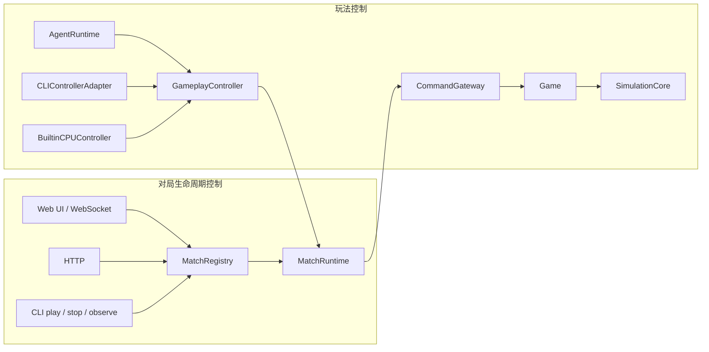

# AGENTS.md

本文件为仓库内工作的编码 Agent 提供上下文指导。

## 项目概述

LLMCraft —— 一个基于 LLM AI 代理的实时战略游戏。两个 AI 控制军队对战，通过 WebSocket 实时同步游戏状态。

**技术栈：** Node.js + TypeScript (monorepo) + React/Vite 前端 + WebSocket 实时通信

## 环境要求

- Node.js 22+
- pnpm 8+ (包管理器)
- TypeScript 5.9+ (启用 strict 模式)

## 常用命令

```bash
# 安装依赖
pnpm install

# 开发模式 - 同时启动 shared/record watch + 前后端
pnpm dev

# 或分别启动：
pnpm dev:shared    # shared 包增量构建
pnpm dev:record    # record 包增量构建
pnpm dev:server    # 仅后端 (端口 3101)
pnpm dev:client    # 仅前端 (端口 3100)

# 测试
pnpm test          # 运行服务端所有测试 (vitest)
pnpm typecheck     # 全仓类型检查
pnpm verify        # 全包 typecheck + server test + server/client/CLI build

# 构建
pnpm build         # 按依赖顺序构建所有包
pnpm build:shared  # 仅构建 shared 包
```

### 运行单个测试

```bash
# 运行指定测试文件
pnpm --filter @llmcraft/server test -- src/__tests__/Game.test.ts

# 按名称模式运行
pnpm --filter @llmcraft/server test -- --grep "Game"
```

### 分析保存的对局录像

排查 `packages/server/logs/records/*.match.json` 时，优先使用内置分析脚本，不要先临时手写解析器：

```bash
# 总览：经济、命令、结果、胜负
pnpm --filter @llmcraft/server analyze:record packages/server/logs/records/<record>.match.json

# 关键时间线：总部压力、掉血、技能、关键命令
pnpm --filter @llmcraft/server analyze:record packages/server/logs/records/<record>.match.json --timeline

# 指定 tick 快照，适合复盘某次交战
pnpm --filter @llmcraft/server analyze:record packages/server/logs/records/<record>.match.json --snapshots "54,59,62,82" --focus player_1

# 分析一次性命令/技能释放时机
pnpm --filter @llmcraft/server analyze:record packages/server/logs/records/<record>.match.json --skill <command_type> --focus player_1
```

当怀疑模型“反应慢”时，先对齐：敌军进入 HQ 5/3/2 格的 tick、HQ 首次掉血 tick、关键技能成功 tick、HQ 死亡 tick。`aiTurns` 为空的旧记录只能反推行为，不能还原模型原文和工具调用链。

## 架构概览

###  monorepo 结构

```
llmcraft/
├── packages/
│   ├── shared/          # 共享类型和常量（需最先构建）
│   ├── record/          # Match Record 校验、旧 JSON 导入与 replay projector
│   ├── server/          # Node.js WebSocket 游戏服务器
│   ├── client/          # React + Vite 前端
│   └── cli/             # action control plane CLI
├── logs/                # 对局记录和调试日志
└── docs/                # 设计文档（ai-api-contract.md 为权威参考）
```

### 包依赖关系

构建顺序：`shared` → `record` → (`server`, `client`)；`cli` 依赖 `shared`

- `@llmcraft/shared` - 无依赖，输出 dist/index.js 和类型定义
- `@llmcraft/record` - 依赖 shared，提供 Match Record validator、旧 JSON importer 和 replay projector
- `@llmcraft/server` - 依赖 shared + record，运行确定性模拟、tool-calling agent 和控制面
- `@llmcraft/client` - 依赖 shared + record，通过 WebSocket 连接服务器

### 核心架构模式

控制流分两个边界：**对局生命周期控制**（MatchRegistry + MatchRuntime，由 Web UI / WebSocket、HTTP、CLI 触发创建、预热、开始、停止、查询和观察）和**玩法控制**（GameplayController，为 LLM、CLI 适配器和内置 CPU 提供同一套观察与动作语义）。两条链路的交叉点在 MatchRuntime，进入 CommandGateway 后只走一条路径。



核心类一句话职责（每条约页 2 页内）:

| 类 | 边界 | 职责 |
|---|---|---|
| `MatchRegistry` | 生命周期 | 管理稳定 `matchId`、对局类型、状态、当前 Web UI 观察对象 和指定对局的停止 / 保存入口；不拥有模拟规则 |
| `MatchRuntime` | 生命周期 | 单局墙钟、500ms tick、专属 CommandGateway 和结束通知；不做 tool loop |
| `CommandGateway` | 玩法门 | envelope 身份、tick、幂等、稳定排序；入队后不再处理游戏规则 |
| `Game` | 玩法 | 持有 WorldState、解释命令、调用 SimulationCore、保存 replay/feedback log |
| `SimulationCore` | 玩法 | 固定顺序 movement → projectiles → economy → harvest → combat → construction → production → victory |
| `GameplayController` | 玩法 | LLM/CLI/CPU 共用的观察与动作工具；生成命令并提交当前 MatchRuntime；管理多 tick Mission 和持续攻击 |
| `GameOrchestrator` | 调度 | 只为 LLM/CPU harness: 创建双方 DecisionController、订阅 committed tick、启动下一轮决策、记录指标 |
| `AgentRuntime` | LLM | LLM tool-calling harness：AgentSession 会话 + ModelTransport 请求 |
| `PresetStore` | 服务端 | 加密存储 Web UI 配置的模型 preset (含 API key)；对局时 `getRuntimeConfig(id)` 解密出 transport 配置 |

下面这些是相对稳定的现状说明，改成代码行为常动时再同步:

**游戏循环 (server/src/MatchRuntime.ts):**
- MatchRuntime 拥有墙钟和单局生命周期，默认 500ms 一个 tick
- CommandGateway 在 tick 边界应用命令，SimulationCore.step 同步更新 WorldState
- 对 LLM 而言，每个 committed tick 都是新的决策机会；某方仍有 in-flight 决策时只跳过该方，不阻塞另一方。built-in CPU 独立使用 `decisionIntervalTicks`，默认 10 tick
- 胜利条件：摧毁敌方所有建筑；HQ 是首要目标，但单独摧毁 HQ 不会结束对局

**Agent 运行时 (server/src/controller/GameplayController.ts):**
- 模型通过只读与动作工具观察/控制游戏，不再生成并执行 JavaScript
- `orchestrate_plan` 与其支持的即时动作使用同一套工具名和参数形状，并暴露给 LLM；生产不属于 plan call，由专用有限队列工具管理；其余 global 建造计划可省略 `unitIds`，由 `MissionRuntime` 在每个 committed tick 持续推进；`cancel_plan` 按 `planId` 直接终止 active plan，显式绑定的单位死亡时 plan 自动失败而不是永久等待
- plan 中的自动建造会自行选址、移动 worker，并在 footprint 被动态占据时立即重选
- HQ、兵营和重工使用严格有序的有限生产队列；`spawn_unit` 一次追加多个 `{ unitType, count }`，`get_production_queue` 查询进度，`cancel_production` 按 order/building 取消。生产逐 tick 扣款，缺钱暂停并自动恢复，取消或建筑被摧毁时退还当前未完成单位已支付的 credits；每建筑每兵种最多保留 100 个待生产单位
- HQ、兵营和重工可持久保存 rally point；单位生产完成后由 ProductionSystem 生成普通 move order，目标占用时复用寻路层的附近可达格解析
- 动作通过 MatchRuntime 专属 CommandGateway 提交，禁止异步直接修改 WorldState

**LLM 调用层 (server/src/model + server/src/PresetStore.ts):**
- GameOrchestrator 只调度 Controller；`LLMControllerAdapter` 持有有状态 AgentSession
- OpenAI SDK、供应商请求参数、响应归一化和逐请求限流属于无状态 `ModelTransport`
- 当前 session 实现是 `OpenAIAgentSession`；`OpenAICompatibleProvider` 只保留连接测试和迁移兼容导出
- AgentSession 历史由 `ContextWindowLimiter` 做临时消息数/字节硬限制；它不是持久 memory 或语义 compactor，并须保持 assistant tool call / tool result 结构完整
- 兼容 OpenAI 风格端点的新模型接入优先扩展 transport，不要直接写进 orchestrator 或模拟层

**Agent turn 与工具调用性能判断:**
- **一个 turn 打完整局是受支持且预期的 harness 设计。** CLI、Claude Code、Codex、Pi 等 harness 都可以在同一个用户/游戏 turn 内持续观察实时状态、连续执行多轮工具调用并完成整场对局；无需为了获得新的 tick 状态而人为切分成多个 turn。
- 模型可一次返回多个 tool calls，本地执行 tool results，再继续下一次模型请求直到对局结束或主动收敛。工具结果携带调用时的实时状态，因此 `requestTick` / `executeTick` 跨度大、单 turn 贯穿多数乃至全部 tick、模型请求或工具调用次数多，**单独看都不是缺陷、失控或决策刷新不足的证据**。
- **禁止仅凭 turn 数、单 turn 时长、首个 turn 覆盖 tick 数，或拿 LLM turn 数量与 CPU committed-tick 调度次数对比，就判断 agent loop 有问题或提出“缩短 / 拆分 / 强制 yield turn”。** 只有出现具体失败证据（例如重复读取而不行动、同类无效命令循环、异常 finish_reason、空输出打满 token、状态明显过期却不重读、内部请求 latency / reasoning 异常）时，才能把问题归因到 turn 内行为。
- 性能分析应落到 turn 内每一次模型请求的 latency、finish_reason、visible output tokens、reasoning tokens、cache hit tokens，以及工具调用是否推动了有效游戏状态变化。慢 turn 的重点风险是某些内部模型请求异常变慢、hidden reasoning 膨胀、可见输出为空却打到 max_tokens，或工具选择陷入重复，而不是“一个 turn 打了很久 / 跑了很多工具”这个事实。

**对局身份与记录:**
- `MatchRegistry` 管理 live/control/benchmark 多个稳定 `matchId`；WebSocket 只投影 observed match
- 正式产物统一称为 Match Record，格式身份为 `match-record`，文件名为 `match-<timestamp>-<short-id>.match.json`
- `MatchRecorder` 支持 `off` / `replay` / `evaluation` 档位；transcript 只是 evaluation record 中的可选内容
- 运行中 delta 在共享 worker 中按块压缩留存，终局或显式保存时只写一次 JSON；不要重新引入 Journal workspace、事实流或 artifact retention 平台
- CLI stdin batch 必须使用 `/sessions/:id/actions` 形成单个 CommandEnvelope；禁止重新引入逐 action HTTP 循环
- control-plane match 默认使用 `evaluation` 档位且关闭 transcript，以保存 CLI/HTTP 命令结果与 controller provenance
- 当前没有每 actor 每 tick 命令数或全局路径命令额度；batch 中每条 action 独立执行，一条失败不会回滚其他成功动作
- CPU-vs-CPU 仅允许用于确定性规则/规模 smoke，不作为模型、策略或平衡样本

## 关键文件

| 文件 | 用途 |
|------|------|
| `packages/server/src/index.ts` | WebSocket 服务器入口 |
| `packages/server/src/MatchRegistry.ts` | 多对局身份、查询与观察选择 |
| `packages/server/src/MatchRuntime.ts` | 单局生命周期、tick 与 committed tick 通知 |
| `packages/server/src/CommandGateway.ts` | 命令校验、幂等与 tick 边界排序 |
| `packages/server/src/Game.ts` | 核心游戏逻辑，命令处理 |
| `packages/server/src/SimulationCore.ts` | 确定性规则阶段编排 |
| `packages/server/src/controller/GameplayController.ts` | LLM/CLI/CPU 共用的玩法控制平面 |
| `packages/server/src/GameOrchestrator.ts` | LLM/CPU harness，调度 DecisionController |
| `packages/server/src/agent/AgentRuntime.ts` | LLM tool-call loop harness |
| `packages/server/src/LLMProvider.ts` | AgentSession、工具循环与迁移兼容接口 |
| `packages/server/src/OpenAICompatibleProvider.ts` | OpenAI AgentSession 与兼容导出 |
| `packages/server/src/model/ModelTransport.ts` | 无状态模型传输契约 |
| `packages/server/src/model/OpenAICompatibleModelTransport.ts` | OpenAI 兼容 SDK 传输实现 |
| `packages/server/src/PresetStore.ts` | 加密存储 Web UI 配置的模型 preset |
| `packages/server/src/MatchRecorder.ts` | Match Record 档位、投影与终局保存 |
| `packages/record/src/` | Match Record 校验、旧 JSON 导入与 replay 投影 |
| `packages/shared/src/types.ts` | 共享 TypeScript 接口 |
| `packages/shared/src/constants.ts` | 游戏常量（HP、造价、地图大小等） |
| `docs/ai-api-contract.md` | AI API 权威文档 |

## 环境配置

模型和 API Key 在 Web UI 的设置面板里配置成 preset，服务端用内置密钥加密落盘（见 `PresetStore.ts`、`packages/client/src/components/SettingsPanel.tsx`）。**不要再用 `packages/server/.env` 配置模型**，那里只有 `PORT` 等少数可选服务端变量。

参考的 preset 生命周期：

- 前端 `SettingsPanel` → `POST /api/settings/presets` → `PresetStore.create`
- 对局时双方各选一个 preset id；`PresetStore.getRuntimeConfig(id)` 解密出 `OpenAICompatibleRuntimeConfig` 交给 transport
- API key 不会离开服务端，不会写进 `.env`，也不会进客户端

## 绝对不能做的事 🚫

- **不要将 `.env` 文件提交到 git** —— 已配置 `.gitignore`，但务必确认
- **不要在客户端暴露 OPENAI_API_KEY** —— API key 只在服务端 `PresetStore` 加密存储，不进前端
- **不要直接修改 `shared/src/constants.ts` 中的常量** —— 会影响整个 monorepo，牵一发而动全身
- **不要绕过 agent tool/CommandGateway 边界开放文件系统、网络或任意模块能力**

## 测试方法

使用 Vitest。关键模式：

```typescript
// Game.test.ts - 游戏逻辑集成测试
const game = new Game();
game.start();
// ... 队列命令，推进 tick，断言状态
```

不要为 system prompt、工具描述或其他指导性文案编写固定字符串测试，包括用
`toContain`、`not.toContain`、整段 `toEqual` 或 snapshot 锁定具体措辞。这类测试
不能验证模型行为，却会妨碍正常的 prompt 迭代。prompt 文案修改通过代码审阅和实际
对局评估验证；只有在存在独立于措辞的结构化逻辑或稳定行为契约时，才为那部分逻辑
编写测试。

## 代码风格约定

- 启用 TypeScript strict 模式
- 优先使用显式类型而非 `any`
- 使用 `@llmcraft/shared` 中的常量（UNIT_TYPES, BUILDING_TYPES 等）
- 结果码：OK = 0，错误为负数（定义在 shared/src/constants.ts）
- 只是调整代码时，用 `rg` 搜索应排除历史日志目录：`packages/server/logs/`，例如加 `-g '!packages/server/logs/**'`，避免对局记录污染搜索结果

## 包特定约定

### `packages/server/src/`
- 新增模型接入优先实现 `ModelTransport`；会话、历史和工具循环留在 AgentSession，不要把供应商 SDK 直接耦合进 `GameOrchestrator`
- 游戏状态修改必须在 MatchRuntime tick 周期内完成，禁止异步修改或绕过 CommandGateway
- WebSocket 消息按类型路由，新消息类型需在 `types.ts` 中定义

### `packages/client/src/`
- 使用 `useWebSocket` 钩子进行通信，禁止直接调用 fetch
- 战场使用 React Three Fiber；高频实例矩阵更新留在渲染循环，避免逐帧重建大型 React state 数组
- 状态更新通过 `GameState` 类型约束，不要扩展未定义字段

### `packages/shared/src/`
- **只放类型定义和常量**，禁止放业务逻辑
- 修改后必须重新构建 (`pnpm build:shared`)，否则其他包不会生效

### `packages/record/src/`
- 只放环境无关的 Match Record 格式校验、历史普通 JSON 导入和 replay projector
- 禁止依赖 Node 文件系统、浏览器 UI 或 SimulationCore；文件写入和运行中 delta 收集属于 server 的 `MatchRecorder` 边界

## 文档一致性约定 📋

修改代码后，按需同步更新文档。区分**必须更新**和**可选更新**：

### 🔴 必须更新（核心文档）

| 当你修改了... | 必须同步更新... |
|-------------|---------------|
| `shared/src/types.ts` 或 `shared/src/constants.ts` | `docs/ai-api-contract.md` —— AI API 契约是权威参考 |
| 游戏机制、单位属性、建筑逻辑 | `docs/current-implementation.md` —— 让开发者能够掌握最新现状 |
| 修复 bug 或发现新问题 | `docs/known-issues.md` —— 问题追踪闭环 |
| 架构边界、控制面、Agent 运行时分层 | `AGENTS.md` 核心架构模式与关键文件 |

### 📦 只读历史，不要更新

| 路径 | 说明 |
|-----|------|
| `docs/archive/**` | 早期设计稿、重构期 roadmap、ADR、baseline 等历史资料；与当前实现不一致以当前代码为准 |
| `docs/ideas.md` | 早期对话和后续想法，仅作探索参考 |

不需要为尚未出现的消费者重新引入通用 Trace、Journal、Experiment、checkpoint 或 retention 平台；新增平台层应先有真实失败样本、明确调用者和验收标准。
