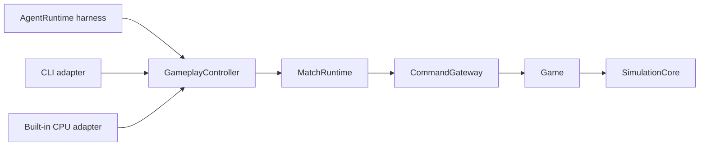

# ADR 0005：统一术语、控制边界与 Match Record

- 状态：Accepted
- 日期：2026-07-20
- 替代：ADR 0002 中持久事件流部分、ADR 0004
- 修正：ADR 0003 的 Controller 命名

## 背景

此前的实现把对局生命周期、玩家下令、模型调度、上下文裁剪和记录产物都放进了名称相近的抽象中，并为尚无消费者的恢复、审计和版本迁移建立了较重的基础设施。本 ADR 以当前真实调用者为准，删除没有被证明需要的平台层。

## 术语表

| 术语 | 唯一含义 |
|---|---|
| MatchDefinition | 一场对局冻结的规则、完整地图、玩家槽位、tick 时长和胜利条件 |
| MatchRuntime | 一场对局的时钟、tick 边界、开始/停止和终局通知 |
| MatchRegistry | 多个对局的稳定 ID、查询列表和前端观察选择 |
| warmup | 开局前提前完成模型首个真实请求；不推进 tick |
| GameplayController | LLM、CLI、CPU 共用的观察/动作控制面和 Command 转换入口 |
| DecisionController | 可由 committed tick 调度的 LLM 或 CPU 决策来源 |
| AgentRuntime | LLM 自己的 tool-loop harness |
| AgentSession | 单个模型玩家的 Prompt、对话历史和工具循环会话 |
| ContextWindowLimiter | 临时的消息数/字节硬限长器，不是 memory 或 compactor |
| CommandGateway | 命令的身份、权限、tick、幂等和稳定排序入口 |
| Match Record | 可选保存的单个对局文件 |
| transcript | Match Record 中可选的模型 messages 和 assistant 原文，不是独立文件格式 |
| BenchmarkRunner | 只执行 benchmark rounds、并发和结果聚合 |

## 两个控制面

### 对局生命周期控制

职责是创建、模型预热、开始、停止、查询和选择观察对局。

- `MatchRuntime` 拥有单局时钟、tick 和结束通知。
- `MatchRegistry` 拥有稳定 `matchId`、查询列表和当前观察选择。
- WebSocket、HTTP 和 CLI 是生命周期控制的触发方式，不拥有模拟。
- `warmup` 只提前执行选中模型的首个真实请求并保留会话结果，不启动 tick，也不创建另一场对局。
- 普通 live 流程只允许一个未结束对局；重复 start 返回提示。
- `llmcraft play` 重复调用只报告当前 active control match，不再创建新对局或新 session。
- benchmark round 可以并行注册；前端可以通过 registry 自由切换观察任意已注册对局。

### 玩家玩法控制

`GameplayController` 是统一的玩家控制面：它提供观察和动作工具，把合法动作转换为 `Command`，并把命令提交到当前 `MatchRuntime`。

`DecisionController` 只是可被调度的决策来源。`LLMControllerAdapter` 和 `BuiltinCPUController` 实现它；CLI 由外部请求驱动，不需要伪装成人类 controller。没有真实手操入口，因此不保留 `HumanControllerAdapter`。

active plans、持续攻击和短期目标缓存会直接影响后续玩法命令，因此由 `GameplayController` 的 MissionRuntime 管理并通过 `get_active_plans` 观察；它们不属于只负责“何时产生下一次决策”的 `DecisionController`。

`GameOrchestrator` 只组装 Agent harness、订阅 committed tick、触发空闲的 `DecisionController` 并收集可选评估数据。它不处在动作转换链路中。

## 调度

- 不使用 100ms 轮询。
- 每个 committed tick 都是一次新的决策机会。
- 某方上一轮仍在运行时只跳过该方；另一方完成后可在后续新 tick 再次决策。
- 不设置固定的双方宏观决策间隔，也不让快方等待慢方。
- 同一玩家同一时刻最多有一个 in-flight 决策，因此不会在同一个世界状态上连续启动无界模型请求。

## 命令与失败

`CommandGateway` 只负责 match/actor/tick、命令 ID、幂等和稳定排序。它不包含每 actor 命令数或全局路径命令额度。

- envelope 的接纳仍是结构校验的整体接纳：越权或重复 ID 时整份输入不入队。
- 进入 `Game` 后，每条命令独立执行；一条失败不会撤销同 envelope 中已经成功的其他命令。
- CLI action batch 逐 action 返回结果；能执行的保留，不能执行的失败，并报告 `partialSuccess`。
- 不保留世界 checkpoint、批次回滚、state hash、确定性 RNG checkpoint 或持久 DomainEvent 流。
- 阻塞后的重新寻路不使用每 tick 4 次的全局额度。

## MatchDefinition 与地图

`MatchDefinition` 是一场对局的冻结组合，不等于地图：

- `map`：地图 ID、宽高、矿脉、障碍物，以及双方 HQ 和初始单位位置；
- `players`：玩家槽位和初始 credits；
- 顶层：ruleset、tick 时长和胜利条件。

模型决策频率、命令输入限制和记录详细度不属于地图或玩法规则。

## 上下文

`ContextWindowLimiter` 只做 provider 消息数量/字节的硬限制。它不是持久 memory，也不是真正的语义 compactor。后续若实现类似 Codex/pi 的压缩，应生成明确、模型可读并可验证的上下文摘要；在此之前不使用 `memory` 命名。

## Match Record

用户产物统一称为 `Match Record`，格式身份为 `match-record`，文件名为 `<matchId>.match.json`。

- `off`：不生成文件；
- `replay`：元数据、定义、初末状态和 tick delta；
- `evaluation`：在 replay 上增加命令结果、Agent turn、工具和模型请求指标；
- `includeTranscript`：仅在 evaluation 中可选保存完整模型 messages 和 assistant 输出。

终局只写一次文件；运行中不重写大 JSON。不生成独立人类可读日志、临时事实工作区、状态 hash 或正式产物 retention 平台。服务端和前端共享的 `@llmcraft/record` 只负责 Match Record 校验、历史普通 JSON 导入和状态投影。

## Benchmark 与离线分析

- `BenchmarkRunner` 直接拥有换边、并发和结果汇总；没有第二类消费者前不建立通用 ExperimentRunner。
- built-in CPU 是用于衡量当前模型/提示词是否达到最低对战能力的 benchmark baseline。
- `analyze-record.mjs` 是开发者或 Agent 读取已有 Match Record 的离线工具，不启动 benchmark，也不属于 runner。

## 结果

这次决定有意删除未被证明需要的恢复、审计和兼容脚手架。若未来出现真实需求，应以具体失败样本、消费者和验收标准新增 ADR，而不是预先恢复通用平台。
