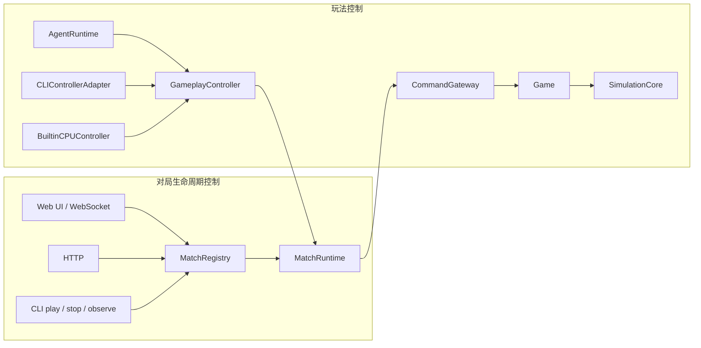

# LLMCraft 当前架构指南

日期：2026-07-20

本文只描述当前代码实际存在的结构。历史设计请看 ADR；如果本文与早期计划文档冲突，以代码、`docs/ai-api-contract.md` 和本文为准。

## 1. 先看全局

LLMCraft 是一个服务端权威的实时战略游戏：

- `MatchRuntime` 推进一场对局的时间；
- `CommandGateway` 在 tick 边界接收和释放命令；
- `Game` 解释命令并持有权威 `WorldState`；
- `SimulationCore` 按固定阶段执行游戏规则；
- LLM、CLI 和内置 CPU 都通过 `GameplayController` 观察和下令；
- WebSocket 把 `MatchRegistry` 中当前选中的对局投影到网页；
- 对局结束后可以选择保存一个 `Match Record`。

最重要的边界是：**开始/停止对局**和**在对局中下令**不是同一种 control。



## 2. Monorepo 包

| 包 | 当前职责 |
|---|---|
| `@llmcraft/shared` | 共享类型、消息协议、内置规则和地图常量 |
| `@llmcraft/record` | Match Record 校验、历史普通 JSON 导入和 replay 投影 |
| `@llmcraft/server` | 对局、模拟、Agent、HTTP/WebSocket、benchmark |
| `@llmcraft/client` | 实时 3D 战场、对局选择、回放和评估数据显示 |
| `@llmcraft/cli` | 外部动作控制入口和可组合命令 |

没有独立的 `trace` 包。当前正式产物叫 `Match Record`。

## 3. 一场对局由什么组成

### 3.1 MatchDefinition

`MatchDefinition` 是一场对局启动前冻结的输入，不等于地图。

它包含：

- `map`
  - 地图 ID；
  - 宽高；
  - 矿脉位置和储量；
  - 障碍物位置；
  - 双方 HQ 初始位置；
  - 双方初始单位类型和位置。
- `players`
  - 玩家槽位；
  - 初始 credits。
- `rulesetId`
- `tickIntervalMs`
- 胜利条件

HQ 和初始单位位置属于地图布局，而不是运行时偷偷补上的数据。

### 3.2 shared constants 与 MatchDefinition

shared 中的 constants/ruleset helper 定义内置 `standard` 模板和游戏数值；`createDefaultMatchDefinition()` 把完整地图布局复制到单局定义中。

二者关系是：

- shared constants：内置规则和地图模板具体是什么；
- MatchDefinition：这一场对局采用了什么。

当前模拟仍只支持内置 `standard` ruleset 和地图布局。完整定义已经形成正确边界，但还不是任意地图编辑器。

### 3.3 MatchRegistry

`MatchRegistry` 只管理：

- 稳定 `matchId`；
- 对局类型：`live`、`control`、`benchmark`；
- 状态和列表；
- 当前网页观察哪个对局；
- 指定对局的停止和保存入口。

它不拥有模拟规则，也不直接修改世界。

普通网页 live 流程只允许一个 active match。CLI 的 `llmcraft play` 也只允许一个 active control match：重复调用会返回已有 `matchId` 和 `reused: true`，不会再创建 session。

Registry 仍能同时登记多个对局，主要用于并行 benchmark，也让前端能自由查看任意已登记对局。普通用户流程不会为了“未来可能多开”而主动制造多局。

## 4. 核心运行类

### 4.1 MatchRuntime

`MatchRuntime` 是单局生命周期和时间边界：

- 拥有墙钟，默认每 500ms 一个 tick；
- 拥有该局 `CommandGateway`；
- 在目标 tick 取出已排队 envelope；
- 调用 `Game.advanceSimulationTick()`；
- 发布 committed tick；
- 在胜负、停止或异常时发布结束通知。

它不做 Agent tool loop，也不解释具体单位命令。

测试和非墙钟 runner 可以调用 `advanceOneTick()` 同步推进。

### 4.2 CommandGateway

`CommandGateway` 处理命令进入模拟前的协议问题：

- `matchId` 和 actor 身份；
- `baseTick`、`applyAtTick`；
- sequence 和稳定排序；
- `clientRequestId` 幂等；
- 命令 ID 和 envelope 结构。

envelope 可以有多条命令，因为一次编队操作或 CLI batch 可以同时产生多个单位命令。

当前没有：

- 每 actor 每 tick 最多 4 条命令；
- 每 tick 总路径命令 100 条；
- 阻塞重寻路每 tick 4 次；
- 命令预算分配器。

envelope 的结构/身份校验仍是整体接纳：如果整个请求越权或 ID 冲突，它不会入队。进入 `Game` 后，每条命令独立执行；一条非法命令不会撤销同批其他成功命令。

### 4.3 Game

`Game` 是游戏规则的门面和权威状态容器：

- 持有 `WorldState`；
- 解释 move、attack、spawn、build、harvest、hold 等命令；
- 在 tick 开始应用已释放命令；
- 调用 `SimulationCore`；
- 保存 replay delta、命令结果、快照和前端/AI feedback log；
- 暴露只读状态给 UI 和 Controller。

可以把它理解成“这一局游戏本身”，而 `MatchRuntime` 是包住它的时钟和生命周期。

### 4.4 SimulationCore

`SimulationCore` 是确定性规则阶段编排器。每 tick 的顺序是：

1. movement
2. projectiles
3. economy
4. harvest orders
5. combat
6. construction
7. production
8. victory

具体规则在 `simulation/*System.ts`，`SimulationCore` 负责固定调用顺序。

如果模拟阶段抛异常，该局 fail-stop。当前不会先克隆整份世界、失败后回滚，也没有 RNG checkpoint、state hash 或额外 invariants 扫描。

## 5. 玩法控制

### 5.1 GameplayController

`GameplayController` 是 LLM、CLI 和内置 CPU 共用的玩法控制平面。

它负责：

- 生成玩家视角观察；
- 执行 read/action/plan 工具；
- 把 tool-shaped action 转成 `Command`；
- 提交命令给当前 `MatchRuntime`；
- 管理多 tick Mission；
- 推进持续攻击命令；
- 保存短期敌方目标缓存；
- 暴露 active plans。

active plans 放在这里，是因为它们会在后续 tick 继续产生玩法命令；它们不是“何时调用模型”的调度状态。

`handleCommittedTick()` 只是让 Mission 和持续战术动作在新世界状态上前进一步。已删除的 `advancePlans()` 名字不再存在，也没有“待处理大组 attack_move 分批释放”。

### 5.2 DecisionController

`DecisionController` 表示能被 committed tick 调度的决策来源。

当前实现：

- `LLMControllerAdapter`
- `BuiltinCPUController`

CLI 是外部 HTTP 请求驱动，使用 `CLIControllerAdapter` 调用同一个 `GameplayController`，不伪装成持续运行的 DecisionController。

当前没有实现人类手操，因此也没有占位 `HumanControllerAdapter`。

### 5.3 GameOrchestrator

`GameOrchestrator` 只用于 LLM/CPU harness：

- 创建双方 DecisionController 和 GameplayController；
- 订阅 `MatchRuntime` 的 committed tick；
- 为当前空闲的一方启动下一次决策；
- 记录可选的 Agent turn/模型指标；
- 处理 warmup、停止和 quiesce。

它不在 `GameplayController -> CommandGateway -> Game` 的动作转换链路中。

调度不使用 100ms poll，也没有固定 5 tick 宏观间隔：

- 每个 committed tick 都提供新决策机会；
- 同一方有一个 in-flight 决策时，只跳过这一方；
- 另一方如果已空闲，可以在新 tick 开始下一轮；
- 快方不等待慢方；
- 同一方不会同时启动多个模型 turn。

### 5.4 AgentRuntime、AgentSession 与 ModelTransport

三层含义不同：

- `AgentRuntime`：LLM 自成体系的 tool-loop harness；
- `AgentSession`：一个模型玩家的 prompt、history 和连续 tool-calling 会话；
- `ModelTransport`：一次无状态 provider 请求和响应归一化。

调用路径是：

```text
GameOrchestrator
  -> LLMControllerAdapter
  -> AgentSession / AgentRuntime
  -> GameplayController tools
  -> MatchRuntime
  -> CommandGateway
  -> Game
```

这里不需要一个叫 Bridge 的中间层。原 `GameAgentBridge` 已改为职责更明确的 `GameplayController`。

### 5.5 ContextWindowLimiter

`ContextWindowLimiter` 当前只按消息数和总字节裁剪 provider history。

它不是：

- 跨对局持久 memory；
- 玩家策略记忆；
- Codex/pi 风格的语义 compactor。

这是临时保护措施。后续应该用真正的 compactor 生成模型可理解、可验证的上下文摘要，而不是继续堆硬截断逻辑。

## 6. 真实启动流程

### 6.1 服务端启动

进程启动时主要完成：

1. 读取模型 preset 和 server settings；
2. 建立 HTTP/WebSocket 服务；
3. 创建空 `MatchRegistry` 和 control session store；
4. 等待网页、HTTP 或 CLI 请求。

它不会因为 server 进程启动就自动创建游戏世界。

### 6.2 网页 live 对局

大致流程：

1. 网页选择双方 preset、记录档位和 transcript 开关；
2. 可选 warmup；
3. 请求创建并注册 live match；
4. `GameOrchestrator.start()` 订阅 committed tick；
5. `MatchRuntime.start()` 启动 500ms 时钟；
6. WebSocket 持续投影 Registry 中 observed match；
7. 终局或用户停止后 quiesce，并按配置保存 Match Record。

`warmup` 的含义是：在 tick 0 前提前完成选中模型的首个真实请求，并把结果留给正式会话。它不推进 tick，也不创建“prepared match”这种第二种对局。

### 6.3 CLI 对局

`llmcraft play --vs rush` 的真实路径是：

1. `POST /api/control/start-game`；
2. 若已有 active control match，直接返回它；
3. 否则创建 `ControlPlaneMatch` 并注册；
4. 创建/绑定 `player_1` control session；
5. CPU 的 `player_2` 已 ready，双方 ready 后启动 MatchRuntime；
6. 后续 CLI action 固定发往该 session 的 `matchId + playerId`。

网页改变 observed match 不会把已有 CLI session 偷偷迁移到另一局。

## 7. CLI / HTTP 动作链路

单个工具请求：

```text
CLI
  -> HTTP control session
  -> CLIControllerAdapter
  -> GameplayController
  -> MatchRuntime.submitCommands()
  -> CommandGateway
  -> 下一 tick 的 Game
```

batch 请求使用 `/sessions/:id/actions`：

- 一个请求带一个 `clientRequestId`；
- actions 数量没有固定 100 条上限；
- 每个 action 独立执行并返回结果；
- 有成功也有失败时返回 `partialSuccess: true`；
- 成功动作不会因为同批另一动作失败而回滚。

批量入口的价值是减少 HTTP 循环并保留请求级幂等，不是提供事务。

## 8. Match Record

### 8.1 名称和档位

正式对局产物叫 `Match Record`，格式身份是 `match-record`，文件名是：

```text
<matchId>.match.json
```

档位：

| 配置 | 内容 |
|---|---|
| `off` | 不生成文件 |
| `replay` | 定义、元数据、初末状态、tick delta |
| `evaluation` | replay + 命令结果、Agent turn、工具和模型指标 |
| `includeTranscript` | 仅在 evaluation 中额外保留完整 messages 和 assistant 原文 |

transcript 只是 Match Record 的可选内容，不是每次 record 都必须写，也不是另一套生命周期。

### 8.2 写入时机

运行中的 delta 和 evaluation 数据暂存在内存。终局或显式 stop 后只写一次最终 JSON，使用临时文件加 rename 完成原子替换。

当前不会：

- 每 tick 重写大 JSON；
- 建临时 Journal workspace；
- 维护 Trace 事实流；
- 写独立人类可读 log 文件；
- 计算 state hash；
- 运行自动 artifact retention 平台。

`@llmcraft/record` 只提供当前 Match Record 的校验/投影，并允许导入项目已有的普通旧 JSON。这里没有名为 v1/v2/v3 的产品版本体系。

## 9. Benchmark 与离线分析

### 9.1 BenchmarkRunner

当前 benchmark 的用途是检验 LLM/prompt 对内置 CPU baseline 的对战表现。

`BenchmarkRunner` 直接负责：

- rounds；
- 换边；
- 并发；
- 结果汇总。

当前没有通用 `ExperimentRunner`。在只有 benchmark 一个消费者时，不建立额外实验平台层。

内置 `random` / `rush` CPU 不是模型能力结论本身，也不是性能规模或平衡样本；它们是最低对战基线。

### 9.2 analyze-record.mjs

`analyze-record.mjs` 是开发者或 Agent 离线读取已有 Match Record 的工具。它不启动 benchmark，也不属于 BenchmarkRunner。

规模/路径能力检查由独立测试和 `strategic-scale-check.ts` 承担，不混进对战 benchmark。

## 10. 错误、停止和保存

命令错误：

- envelope 协议错误：不入队；
- 单条游戏命令错误：只记录该命令失败；
- 同批其他合法命令：保留成功结果。

模拟错误：

- 当前 tick 抛异常；
- MatchRuntime 标记 failed 并停止墙钟；
- 不尝试在半失败世界上继续。

正常停止：

1. 停止新 tick；
2. abort 正在运行的 Agent/CPU 工作；
3. 等待 in-flight 工作退出，即 quiesce；
4. 按记录配置保存一次 Match Record。

这套等待主要避免“文件已经保存，旧异步 turn 又回来追加数据”。它不是崩溃恢复、分布式事务或审计平台。

## 11. 当前限制

- `summary` 仍由服务端拼成字符串；
- `ContextWindowLimiter` 不是语义 compactor；
- 长局的 replay/evaluation 数据在终局前占内存，仍需真实规模测量；
- 完整 MatchDefinition 已包括开局布局，但模拟仍只接受内置 standard；
- 没有人类手操 adapter；
- WebSocket 只投影一个 observed match，多个对局不是同时渲染。

## 12. 推荐阅读顺序

想理解真实执行链路，按这个顺序看：

1. `packages/server/src/MatchDefinition.ts`
2. `packages/server/src/MatchRegistry.ts`
3. `packages/server/src/MatchRuntime.ts`
4. `packages/server/src/CommandGateway.ts`
5. `packages/server/src/Game.ts`
6. `packages/server/src/SimulationCore.ts`
7. `packages/server/src/controller/GameplayController.ts`
8. `packages/server/src/GameOrchestrator.ts`
9. `packages/server/src/agent/AgentRuntime.ts`
10. `packages/server/src/control/ControlRoutes.ts`
11. `packages/server/src/MatchRecorder.ts`
12. `packages/record/src/index.ts`

术语和边界决策见 `docs/adr/0005-terminology-and-control-boundaries.md`。

## 13. 修改代码时放在哪里

| 需求 | 应放位置 |
|---|---|
| 新单位/建筑规则 | shared ruleset + 对应 simulation system |
| 新地图内容 | MatchDefinition/map template |
| 新动作工具 | GameplayController + AgentTools/CLI adapter |
| 新模型供应商 | ModelTransport |
| 新 Agent loop 行为 | AgentRuntime / AgentSession |
| 改决策触发时机 | GameOrchestrator / DecisionController |
| 改 tick 生命周期 | MatchRuntime |
| 改命令身份、幂等、排序 | CommandGateway |
| 改网页观察哪个对局 | MatchRegistry + WebSocket/MatchPanel |
| 改录像字段或投影 | shared MatchRecord 类型 + `@llmcraft/record` |
| 改 benchmark rounds/并发 | BenchmarkRunner |

不要为了尚未出现的消费者重新引入通用 Trace、Journal、Experiment、checkpoint 或 retention 平台。新增平台层应先有真实失败样本、明确调用者和验收标准。

## 14. 真实链路验证

2026-07-20 使用当前代码完成了一场 `llmcraft play --vs rush`：

- control match：`match_2c80a34e-89e3-4323-982d-504459c3ded1`；
- 重复执行 `play` 返回 `reused: true`，没有创建第二场对局或第二个 session；
- CLI 实际完成采矿 Mission、建造兵营、连续生产 3 名 rifleman，并提交 3 单位攻 HQ Mission；
- 网页通过 WebSocket 观察同一 `matchId`，实时显示 tick、双方单位/建筑/credits、战术日志和 3D 战场；
- 对局在 tick 398 自然结束，`player_2` 获胜；
- 终局自动生成单个 replay 档位、无 transcript 的 `.match.json`；
- `analyze-record.mjs` 成功读取该文件，报告 398 ticks（199 秒）、胜者和最终经济/兵力。
- 验证中发现 CLI state 的 lobby status 在已有 winner 时仍显示 `running`；现已统一为 `finished` 并加入回归测试。

这次验证覆盖的是完整运行链路，不是直接改状态或只调用测试 helper。
