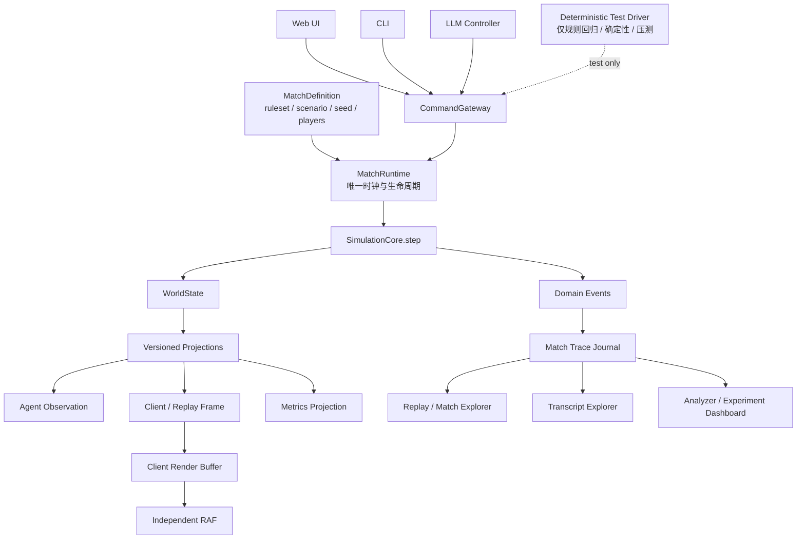
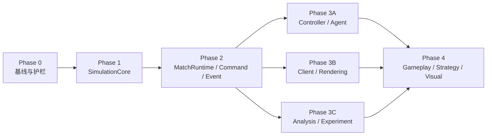

# LLMCraft 架构、工具链与产品演进 Roadmap

> 状态：Draft
>
> 最后更新：2026-07-16
>
> 本文是 LLMCraft 中长期演进的主路线，用于统一架构重构、Agent 能力、分析工具、游戏平衡和画面工作的先后关系。具体缺陷仍在 `docs/sprint/current-issues.md` 跟踪；AI 工具契约仍以 `docs/ai-api-contract.md` 为准。

## 1. Roadmap 目标

LLMCraft 的最终目标不是让两个模型沿单线持续出兵，而是让不同模型能够表现出可辨识的战略风格，并在可复盘、可比较、相对公平的环境中进行大规模实时战略对抗。

期望最终能够稳定看到：

- 多线推进、分兵、佯攻、扰矿、偷袭、回防和兵种协同。
- 数十到数百单位的大军团作战，而不是逐个单位葫芦娃式送兵。
- 快模型通过更及时的战术响应取得局部优势，慢模型仍能依靠宏观规划、持续任务和资源配置竞争。
- Live、CLI、Benchmark 和 Replay 使用同一套对局语义，不再出现某条运行路径不可观察、不可保存或行为不同。
- 每次规则、Prompt、模型和架构调整都能通过结构化记录与批量实验说明“为什么变好或变坏”。

当前最重要的判断是：玩法和画面问题之下，还有运行时、状态所有权、控制器、记录与分析工具的系统性问题。在这些基础问题得到控制前，继续堆叠玩法会扩大返工范围，并使后续平衡结论不可信。

## 2. 当前阶段的核心约束

以下约束在 Roadmap 前半段保持不变：

1. 不进行一次性推倒重写，采用可验证的渐进迁移。
2. 第一阶段保留当前 500ms 模拟步长和现有玩法数值，不把架构迁移与平衡调整混在一起。
3. 现有寻路、战斗、经济、地图、规则函数和 3D 资产应尽量复用。
4. 新机制原则上暂停，只有修复回归、补齐重构护栏和解除迁移阻塞的改动可以提前进入。
5. 旧录像只能用于个案参考；缺少 Agent trace、版本信息或新规则字段的记录不能作为新平衡结论的主要证据。
6. 在网络安全边界明确前，服务端按“受信任本地开发模式”看待，不宣称支持公网或不受信任多人环境。

## 3. 目标架构原则

完成核心迁移后，系统必须满足以下不变量：

1. `MatchRuntime` 是对局生命周期和模拟时钟的唯一所有者。
2. `SimulationCore` 只执行确定性的 `step`，不持有定时器，不调用模型，不发送网络消息，不写文件。
3. `WorldState` 是唯一权威世界状态；客户端状态、Agent 观察和回放帧都是投影。
4. Web UI、CLI、LLM 和未来的人类玩家都通过同一个 `CommandGateway` 提交命令；确定性测试驱动也经过该入口，但不属于产品 Controller。
5. 命令只在明确的 tick 边界应用，支持批处理、幂等、排序、归属、预算和结果关联。
6. 每个 tick 的输入与输出可记录、可校验；相同 MatchDefinition、seed 和命令序列应产生相同状态 hash。
7. 模拟时间、模型决策时间、网络同步时间和客户端渲染时间互相独立。
8. `Controller` 表示决策来源；`ModelTransport` 只表示模型 API 传输，两者不能继续混为 `LLMProvider`。
9. 录像、Transcript、诊断和 Benchmark 从同一套版本化事件与 trace 数据生成。
10. 原始事实指标与启发式诊断分离；诊断规则可版本化并重新应用到旧数据。
11. 单位、建筑及后续地图实体共享统一的实体身份、查询和生命周期规则；不强制采用深继承或把所有行为塞进一个 `GameObject` 基类。

## 4. 目标结构



## 5. 分阶段路线

### Phase 0：止血、基线与重构护栏

目标：在重构前保留足够的行为证据和自动化护栏，但不围绕旧架构建设最终的观测平台。

#### 主要工作

- 修复当前 strategic smoke 中 worker 建造规则导致 CPU 无法发展的回归。
- 为建造、经济、生产、移动、攻击、胜负和长局录像增加表征测试。
- 增加同输入多次运行的状态 hash 对比测试，为确定性迁移建立基线；允许先使用测试专用的最小实现。
- 保存一组可重复使用的基准对局、record、必要的 transcript 和关键分析结论，明确记录其代码版本和已知数据缺口。
- 审计现有 Record、Transcript、Analyzer 和 Diagnostics 的能力边界，将不可信或已过期的字段显式列入问题清单。
- 为 MatchRuntime、Command/Event、Controller 和 Record/Trace 编写 ADR，先确定所有权与迁移边界。
- 只补充重构必需、低侵入的临时诊断，不重写 Transcript Viewer，不设计最终 schema，不扩展旧日志格式。
- 除修复基线和解除重构阻塞外，暂停新增玩法机制、逐单位工具和分析页面功能。

#### 基线材料

- 当前代码版本、规则和地图配置。
- 可稳定复现的建造、经济、生产、交战和胜负场景。
- 至少一组短局和长局 record，以及能够解释其行为的人工复盘说明。
- 当前 transcript、record 和 analyzer 缺失信息清单，防止迁移过程中把“没有记录”误判成“没有发生”。
- 当前测试、smoke、真实对局的通过/失败结果。

#### 验收门槛

- `pnpm verify` 通过。
- strategic smoke 能完成建造、生产和交战，不再出现双方 360 tick 零战斗单位。
- 核心表征测试能够锁定当前可接受的规则行为和 tick 阶段顺序。
- 相同固定输入的基线测试能够比较每 tick 或关键 tick 的状态 hash。
- 基准样本、运行命令、代码版本和已知数据缺口有明确记录。
- 四份 ADR 给出唯一所有者、目标边界、迁移顺序和明确不做的事项。
- Phase 0 没有为旧 GameOrchestrator 新建另一套长期 Record/Transcript 架构。

### Phase 1：提取确定性的 SimulationCore

目标：把“游戏规则如何推进”从“何时推进、谁在控制、如何广播”中分离出来。

#### 主要工作

- 将 `Game.tickUpdate()` 拆为可直接调用的 `SimulationCore.step(input)`。
- 移除 SimulationCore 内部的 `setInterval`、文件写入、WebSocket、LLM 和回放职责。
- 引入 `MatchDefinition`，显式传入 ruleset、scenario、地图、玩家、胜利条件和 seed。
- 收敛权威状态：取消 UnitManager/BuildingManager、players 集合、tiles/tileView/resourceRemaining 之间的多重真相。
- 建立统一的实体 ID、类型判别、注册、查询、创建和销毁约束；Unit、Building 可以保留各自的数据结构和系统，不以传统深继承作为目标。
- 将 `my`、客户端动画 intent 等观察者或表现字段移出权威实体。
- 定义 tick 阶段顺序和不变量检查。
- 对 tick 异常采用 fail-stop 或原子提交策略，不再保存部分成功的世界状态作为正常快照。
- 为随机行为提供可注入、可记录的 seeded RNG。

#### 实施进度（2026-07-16）

- `WorldState`、统一实体身份、观察投影和原子 rollback 边界已落地。
- Movement、Projectile、Economy、HarvestOrder、Combat、Construction、Production 和 Victory 已成为独立无 I/O 系统，`SimulationCore.step(WorldState)` 直接组合唯一规则顺序。
- `Game` 中的 phase 反向调用已删除；剩余兼容责任是旧命令解释、GameLog 投影和 snapshot。它们将在 Phase 2 分别迁入 CommandGateway、DomainEvent projector 和 Trace Journal。
- seeded RNG 契约已落地：MatchDefinition.seed 初始化可序列化随机流，RNG 状态纳入 checkpoint 和 hash；正式实体创建/销毁也已收口到 EntityRegistry / WorldState。Phase 1 验收门槛已满足，后续新规则仍必须持续遵守这些边界。

#### 验收门槛

- 测试可以在没有墙钟定时器的情况下同步推进任意 tick。
- 相同 MatchDefinition、seed 和命令序列的每 tick hash 完全一致。
- SimulationCore 不依赖 HTTP、WebSocket、模型 Provider、文件系统或浏览器时间。
- 当前核心玩法表征测试保持通过；若行为变化，必须有单独决策记录和新基线。
- Tick 中间异常不会留下可继续推进的部分状态。
- 任意权威实体都能通过统一身份定位，其创建、销毁和引用失效语义一致，不再由各 Manager 各自解释生命周期。

### Phase 2：统一 MatchRuntime、命令、事件与对局生命周期

目标：让 Live、CLI、Benchmark 和 Replay 围绕同一个对局运行时工作。

#### 实施进度（2026-07-16）

- CommandEnvelope v1 与对局专属 CommandGateway 已落地；LLM live、plan 和 CLI/control-plane 动作已迁入该入口，并有幂等、整批授权校验、tick 边界和确定性排序测试。
- Gateway 事实、命令结果与 SimulationCore outcome 已统一为具有稳定类型、关联 ID 和单调 `eventSequence` 的 DomainEvent v1；对局 MatchJournal 流式追加 NDJSON，内存窗口上限为 `500` 条。旧的静默命令失败现在也会产生 `command_invalid` 结果。
- `MatchTraceRecordV3`、显式 capability 标记和运行时 validator 已落地；活跃 MatchJournal 现在记录 manifest、完整 command submission、DomainEvent、AI turn、terminal event 和每个已提交 tick 的 state hash。hash v2 包含 seeded RNG 游标，manifest 带完整 MatchDefinition/seed，并跟踪 created/running/stopped/finished/failed 状态。
- MatchRuntime 已区分“SimulationCore 失败并回滚”和“tick 已提交后 journal 写入失败”：后者会以 `committed: true` fail-stop，但不会伪造 `simulation_tick_failed` 或 rollback 事件。
- Trace v3 finalizer 已落地：`saveRecord()` 对 journal 与 Game 历史捕获一致 cut，长数组流式写临时文件、`fsync` 后原子 rename；失败会删除临时输出，并发相同 cut 的保存请求会复用同一 Promise/文件。正式文件包含事实流和显式标为派生缓存的 replay projection。
- 新增独立 `@llmcraft/trace` 包，统一提供 trace/compact 格式识别、validator、`compact-v2 -> trace-v3` 显式缺失能力迁移，以及 `trace-v3 -> GameRecord` projector。远程 Replay、本地 JSON、Diagnostics、Analyzer 和旧 compact 工具已接入同一 projector；旧 compact 迁移不会伪造 command/event/hash。
- `MatchRecorder` 已从 `GameOrchestrator` 中提取，live 与 CLI/control-plane 都通过同一条一致 cut、去重和 Trace v3 finalizer 路径保存；controller 只提供参与者与模型上下文元数据，不再各自实现 record builder。
- `MatchRegistry` 已替代服务端的单一 `state.orchestrator/state.controlMatch` 所有权，live、control 和 benchmark round 都有稳定 `matchId`，可以并发注册、查询、停止和保存。WebSocket 只投影 registry 中当前 observed match；切换观察不会停止其他对局。
- control session 现在绑定具体 `matchId`；HTTP/CLI 已支持列出对局、选择 Web UI 观察对象、停止指定对局以及保存指定对局或当前 session 的 Trace v3。benchmark 的每个 round 也独立注册并在完成后保持可查询。
- 主 Web UI 已增加只读的“对局观察”选择器，直接消费共享 `MatchRegistryListResponse`，可列出 live/control/benchmark match 并切换 WebSocket 当前投影；切换不会停止、暂停或接管其他对局。该入口不是 CPU 对局创建器。
- 临时 journal 已改为进程 owner / 单局 workspace 两级所有权；同一 `matchId` 会创建独立 workspace，不再清空旧目录。终局收尾会先 quiesce controller、写出正式 Trace，再 seal 并删除临时 workspace；自然结束由 registry 周期收尾，SIGINT/SIGTERM 会 stop+save 全部需要保留的 match。`recordReplay=false` 的 benchmark round 明确 discard 临时 journal，不会被后台偷偷保存为产品记录。
- 启动时会识别失活 owner，把异常遗留 journal 连同 recovery provenance 移入 `logs/orphan-journals`；旧版无 owner 的目录经过安全宽限期后也进入恢复区。record、benchmark record、两类 transcript 和 orphan journal 已接入统一的年龄/数量/容量策略，支持版本化固定样本清单及 `.keep` / `.llmcraft-keep`，CLI/HTTP 默认输出逐 artifact dry-run，只有显式 `--apply` 才清理正式产物。orphan 恢复区会自动执行独立保留策略。
- CLI 的 stdin selection/pairing 和 `orchestrate` action batch 已改为单个 `POST .../actions`、单个 `CommandEnvelope`。controller 在预校验失败时恢复 plan/attack 等内部状态；Game 在 tick 内为每个 envelope 建 checkpoint，任一命令失败或超过剩余路径预算时回滚整批，不再部分成功或把余下命令延期到后续 tick。`clientRequestId` 的相同内容重试返回缓存结果，不重复执行；不同内容复用同一 ID 明确冲突。
- `MatchDefinition v2` 已把每 actor 每 tick `100` 条命令和全局 `4/tick` 路径命令写入版本化 `rules.commandBudget`；Gateway 接纳、Game 公平分配和 Trace manifest 都消费同一份定义。旧 v1 Trace 仍按冻结的历史默认预算读取，不会发生同版本语义漂移。
- replay delta 已在每个已提交 tick 流式写入 journal，MatchRuntime 随即释放 Game 内兼容 delta 缓存；1001 tick 验收仍能从 journal 生成完整 1001 个 delta。正式文件改为 `.trace.json.gz`，以 64 KiB gzip chunk 流式写入、`fsync` 并原子 rename；旧 `.json`、远程 Replay、本地上传、Analyzer 和 compact 脚本保持兼容。
- replay projection 的 `commandResults` 已由权威 DomainEvent projector 生成；Analyzer 对 Trace 直接统计 `command_result` facts。Transcript Viewer 可直接打开服务端或本地 Trace，展示 AI turn、tool call、command 与关联 DomainEvent，并显式标注仍为 partial 的 model/tool spans；旧文本只保留兼容导入。
- Live、CLI 和 LLM-vs-CPU Benchmark 已通过同一套参数化 MatchRuntime/Trace 契约测试；慢 WebSocket 达到 `1 MB` backlog 后不再追加过期全量帧，排空后只发送最新投影。Phase 2 验收门槛已满足，后续主线进入 Phase 3A/3B/3C。

#### 主要工作

- 新建 `MatchRuntime`，统一驱动 SimulationCore、控制器调度、命令调度和事件日志。
- 新建 `MatchRegistry`，支持多个并发 match，而不是单一 `state.orchestrator` 或 `state.controlMatch`。
- 定义版本化 `CommandEnvelope`：

```ts
interface CommandEnvelope {
  matchId: string;
  actorId: string;
  baseTick: number;
  applyAtTick: number;
  sequence: number;
  clientRequestId: string;
  commands: GameCommand[];
}
```

- 支持原子批处理和幂等提交，避免 CLI 逐单位 HTTP 请求跨越多个 tick。
- 为双方设置明确且公平的命令预算、寻路预算和调度顺序，不再由墙钟到达顺序抢占全局预算。
- 定义结构化 DomainEvent，不再用 UI/AI `GameLog` 充当事件总线。
- 定义 Record/Trace schema v3 和运行时校验器。
- 引入贯穿全链路的 `matchId / actorId / turnId / modelRequestId / toolCallId / commandId / eventSequence`。
- 建立统一 Match Trace Journal，使用结构化追加格式记录 manifest、命令、事件、Agent trace、keyframe 和状态 hash；纯文本 transcript 只作为导出。
- Trace Journal 采用流式追加、分块与压缩，不要求把整局历史常驻堆内存；明确运行中临时文件、对局完成后的正式 record 和 transcript 导出的生命周期。
- 为 record、benchmark record、transcript 和异常遗留 journal 提供配置化保留策略，包括最大年龄、文件数或总容量、固定样本保护、启动时孤儿回收和显式清理入口。
- 建立统一 projector/migrator，删除 GameHistory、compact script、Replay、Diagnostics 和 Analyzer 中重复的 diff/apply 解释。
- 迁移顺序：Live -> CLI/control-plane -> Benchmark。
- 让前端可以观察 MatchRegistry 中指定的 match，CLI 对战自然可见并可保存回放。

#### 验收门槛

- 同一套 integration suite 可以针对 Live、CLI 和 Benchmark 运行。
- CLI 管道的一次批量动作只产生一个 CommandEnvelope，并在同一 tick 原子应用或明确拒绝。
- 重复提交相同 `clientRequestId` 不会重复执行。
- 两个及以上 match 可以并发运行、查询、停止、保存和观战，状态不会串线。
- Live、CLI 和 Benchmark 保存同一 record schema，并由同一个 projector 回放。
- 新 record 通过 schema 校验；不兼容旧 record 必须显式迁移或标记能力缺失，不能静默当作当前格式。
- 长局记录在明确内存预算内持续写入；正常结束不遗留临时 journal，异常退出产生的孤儿文件可在下次启动时识别和回收。
- 保留策略不会删除标记为基准样本或固定的记录，并可在清理前报告将释放的文件与容量。
- 慢消费者只接收最新投影或明确的增量，不会无限累积 WebSocket backlog。

### Phase 3A：重建 Controller 与 Agent Runtime

目标：让模型速度、战略规划、任务执行和微操能力成为显式设计，而不是异步请求延迟的偶然结果。

当前进度：已完成。LLM、CLI、human 和 deterministic test driver 均通过独立 Controller adapter 接入；Builtin CPU 已退出 LLMProvider/AgentSession。ModelTransport 无状态，AgentSession 持有 Prompt、MemoryPolicy 和 tool loop。`ObservationProjection / MissionRuntime / AgentPolicy / CommandGateway` 形成明确边界；Prompt 镜像、配对宏观预算、跨 tick Mission、完整请求/工具/命令 trace、失败与重试、命令 provenance、子 Agent lease/并发与 parent 归属均已落地。

#### 主要工作

- 定义统一 `Controller` 接口，LLM、CLI 和人类控制分别实现。确定性测试驱动使用独立 test adapter 经 CommandGateway 发送命令，不作为正式玩家类型。
- 将 `OpenAICompatibleProvider` 拆成无状态 `ModelTransport` 与有状态 `AgentSession`。
- `AgentSession` 负责 Prompt、历史、上下文压缩、MemoryPolicy、工具循环和 trace。
- Agent trace 记录每次内部模型请求的 latency、finish reason、input/output/reasoning/cache tokens、重试、错误和实际 messages 版本。
- 工具 trace 记录开始/结束时间、观察 tick、结果 tick、耗时、结果大小和关联命令。
- Prompt 从 MatchDefinition、玩家方位、ruleset 和能力列表生成，不再静态使用 player_1 开局坐标。
- 将 GameAgentBridge 拆为 ObservationProjection、CommandGateway、MissionRuntime 和 Policy/Hints。
- 用低频宏观决策生成 mission；MissionRuntime 在后续 tick 中确定性执行生产、采矿、编队、进攻和回防任务。
- 定义模型公平策略：宏观决策额度按模拟时间分配；模型快慢不直接决定无限制的决策次数。
- 将快速战术响应作为受预算的事件触发能力，与宏观规划分开统计。
- 为上下文设置明确上限、压缩策略和状态摘要版本，不再让 Provider history 无界增长。
- 子 Agent 必须通过独立 Controller 身份和 CommandGateway 工作，增加单位/建筑 lease、并发上限、请求预算和审计；在这些完成前可默认关闭。

#### 验收门槛

- 旧 Builtin CPU 从产品运行时退出；需要保留的规则行为收缩为确定性 test driver，不再伪装成 LLMProvider，也不实现 testConnection、warmup 或 subagent API。
- 红蓝双方收到根据自身方位生成的对称 Prompt 和开局建议。
- 使用不同模拟延迟的 fake model 时，宏观决策额度符合相同策略，命令应用规则可复现。
- Mission 可以在没有后续模型调用时持续完成多 tick 的采矿、建造、生产或编队推进。
- Trace 能区分宏观规划、Mission 执行、战术中断和直接工具微操。
- 任意 Agent turn 都能从 `turn -> model request -> tool call -> command -> command result` 完整关联。
- 子 Agent 无法操作未租赁单位，所有命令有明确 controller/parent 归属。

### Phase 3B：拆分客户端时间域与状态传输

目标：让画面平滑度和浏览器性能不再直接取决于服务端 tick 到达时刻。

当前进度：已完成。WebSocket 使用 v1 keyframe/delta 和完整时间 metadata；`@llmcraft/trace` 提供 Live/Replay 共用 exact projector 与有界 `SimulationFrameBuffer`。R3F 在 RAF 中直接更新 instance matrix，已删除逐帧全单位 React state 数组。record metadata 保存 tick interval，Replay/统计不再强制按 500ms 解释。

#### 主要工作

- 服务端投影携带 `simulationTick / simulationTime / serverTime / frameSequence`。
- 客户端维护小型 frame buffer，根据模拟时间插值，不再使用到包时间除以固定 500ms。
- Three.js/R3F 渲染通过 ref 和实例矩阵更新单位，避免每个 RAF 对全体单位执行 React setState。
- React 只承载设置、统计、日志和选择等 UI 状态。
- 状态同步改为版本化 keyframe + delta/event，并为慢客户端执行合并或 latest-frame-wins。
- Replay 使用同一 frame projector 和渲染缓冲，不再维护独立的动画时间解释。
- 将规则中的速度、冷却、建造和生产逐步表达为秒或规则时间单位；完成后再评估是否将模拟步长从 500ms 调整为 100-200ms。

#### 验收门槛

- 模拟 100-500ms 网络抖动时，单位不会因到包间隔改变而明显加速、减速或跳变。
- RAF 路径不再为所有单位创建新的 React state 数组。
- 200v200 压力场景保持明确的帧率和内存基线，长时间运行无持续增长。
- Live 与 Replay 在相同 tick 的实体位置和事件一致。
- 改变网络广播频率不会改变游戏规则或动画速度。

### Phase 3C：建立分析与实验平台

目标：将 Transcript、Replay、Diagnostics 和 Benchmark 从独立小工具收敛成同一套研发分析平台。

当前进度：已完成平台基线。`@llmcraft/trace` 现在同时提供 schema/validator/migrator/projector、带来源路径的 metric registry、ruleset 版本化 detector 和 Live/Replay frame buffer。Match Explorer 从 Trace 对齐 tick、真实 messages、model request waterfall、tools、commands、DomainEvents 与 Diagnostics，并可跳到主回放的对应 tick；历史 compact-v2 也会直接读取结构化 `aiTurns`。Analyzer 的 human/JSON/CSV 共用同一事实解释，支持目录批处理和 baseline 均值差异。Benchmark 使用 `ExperimentRunner` 的 seed/换边配对/重复/并发调度，显式 experimentId 会校验 Manifest、原子持久完整 round payload，并在重启时恢复已完成汇总、只补未完成试验；报告包含 Wilson 95% CI、方位偏差、中位/P90 时长，Experiment summary 同时汇总 latency/token/cost。后续新增战斗与策略指标属于 Phase 4 的按实验扩展，不再改变这套平台边界。

#### 主要工作

- 建立 `recording/analysis` 共享库，包含 schema、validator、migrator、projector 和 metric registry。
- 将 Replay、Transcript 和 Diagnostics 合并为 Match Explorer：战场 tick、Agent waterfall、工具调用和命令结果可以互相跳转。
- 修复或替换旧 Transcript Viewer，只消费结构化 trace，不再解析交错的旧纯文本分段。
- Transcript 展示每个内部模型请求的 latency、finish reason、token、cache、重试、工具调用和观察陈旧度。
- Analyzer 同时支持人类输出、JSON、CSV、目录批处理和 baseline 对比。
- Analyzer 的兵种、建筑、时间和价值统计从 record/ruleset 读取，不再写死 soldier、barracks 和 500ms。
- 将事实指标与 Detector 分离；Detector 记录版本、阈值和适用 ruleset。
- 建立 Experiment Manifest，记录实验变量、固定变量、baseline 和重复次数。
- Benchmark 升级为 Experiment Runner：支持 seed、换边配对、重复运行、并发、失败恢复和结果持久化。
- 实验报告至少展示胜率置信区间、方位偏差、中位/P90 时长、模型 latency/token/cost 和行为指标分布。
- 支持在 CI 或手动验证中设置有限的回归门槛，但避免用单局胜负阻塞合并。

#### Phase 4 按实验扩展的指标目录

以下是平台基线之上逐步增加的领域指标，不再阻塞 Phase 3 的架构收口；每项仍必须进入同一 metric registry，并声明版本、来源事实和适用 ruleset。

经济：

- 收入/支出曲线、平均和峰值闲置资金、闲置资金时间积分。
- Worker 空闲率、采集利用率、矿点饱和度、运输距离和资源枯竭时间。
- 首个生产建筑时间、产能利用率、队列阻塞和科技路线时间。

战斗：

- 按单位类型和 armor 的伤害造成/承受、资源价值交换和单位寿命。
- 首次接敌、首次建筑伤害、增援时间、集火程度和过量伤害。
- 寻路失败、改路、拥堵、命令覆盖和无效目标比例。

Agent：

- 每次内部模型请求 latency 和 token 分类。
- 观察 tick 到工具调用、命令提交、命令应用之间的陈旧度。
- 读工具重复率、动作转化率、无效工具率、命令成功率。
- Mission/Plan 注册、完成、失败、等待和中断比例。
- 宏观决策、战术中断、直接微操和子 Agent 的贡献与成本。

观赏性与策略多样性：

- 同时活跃战线数、军团数量、军力集中度和目标多样性。
- 扰矿造成的资源损失、分兵收益、偷袭建筑价值和回防延迟。
- 单位组合多样性、科技路线多样性、命令 churn 和无效往返。

#### 验收门槛

- 任意指标都能追溯到 record 中的原始事件和 metric/detector 版本。
- 同一 record 在 CLI Analyzer、Match Explorer 和 Experiment Dashboard 中得到一致的基础事实。
- 可以一条命令比较两个实验目录并输出机器可读差异。
- Benchmark 支持同 seed 换边配对，并报告样本数和置信区间。
- 修改 Detector 阈值后可以重新分析旧 record，无需重新运行比赛。

### Phase 4：用可信实验驱动玩法、策略和观赏性

目标：在运行时和工具链稳定后，开始针对原始产品目标做有证据的迭代。

当前进度：已完成首轮真实浏览器基线与两轮复赛，并修复非法 Mission 无限 retry、Command provenance 丢失、provider multi-tool 历史不闭合和计划生产塞满队列。实验中曾加入固定战略阶段、分兵阈值与自动主力/侧翼编组，但确认这会让运行时越界替 LLM 决策，现已撤销。下一步先设计中性战场事实和开放、持久、可追踪的 Strategic Intent 表达，再将多线出现率、扰矿收益、目标多样性和换边偏差作为 Analyzer/Experiment 的评价指标，而不是运行时策略模板。

#### 经济与生产

- 通过收入曲线、worker 利用率和闲置资金积分判断采矿是否真的过慢，而不是凭单局观感调整。
- 校准开局 worker 数量、携带量、采集/运输时间、建筑成本、生产时间和扩张收益。
- 让多生产建筑和前线 refinery 在合理时机产生真实战略价值。

#### 战略表达能力

- 提供 squad/army/front/mission 级控制，而不是继续增加逐单位工具。
- 支持守家、骚扰经济、侧翼推进、主攻、佯攻、侦察和撤退等高层任务。
- 提供有限且明确的敌情记忆、威胁评估和任务优先级。
- 让同一玩家同时维持多个不冲突 mission，为多线与大军团作战提供执行基础。

#### 兵种与地图

- 基于资源价值交换、存活时间和生产选择率调整兵种，而不是仅看胜率。
- 评估三战线地图是否提供足够的侧翼入口、资源争夺点和增援路线。
- 为大军团减少狭窄 chokepoint 和出生拥堵，同时保留可读的战术地形。

#### 画面与表现

- 在渲染时间域稳定后补正式行走、射击、死亡动画和建筑碰撞代理。
- 加强军团、战线、任务目标和关键事件的观战可读性。
- 让镜头、特效和 UI 突出策略变化，而不是只突出单位数量。

#### 验收方向

- 多局实验中，多战线、分兵或骚扰行为出现率显著高于当前基线。
- 军力集中度不再长期接近单一大团，且分兵不会因为执行层失控而普遍降低胜率。
- 快慢模型的优势来源可以从 trace 中解释，不再只有“请求更快所以行动更多”。
- 大规模战斗的帧率、tick duration 和模型观察体量均在明确预算内。
- 玩法调整同时提供单局案例、批量指标和回归风险说明。

## 6. 阶段依赖与并行关系



Phase 3A、3B、3C 在 Phase 2 的公共契约稳定后可以并行。Phase 4 的单项探索可以提前做原型，但正式合入和数值结论必须通过 Phase 3C 的实验与记录门槛。

## 7. 优先级总表

| 优先级 | 工作 | 原因 |
|---|---|---|
| P0 | 修复 strategic smoke / 建造回归 | 当前基线已经无法进行有效战略对局 |
| P0 | 表征测试、基准样本、state hash、ADR | 为渐进迁移建立最小行为护栏，避免在旧架构上建设最终平台 |
| P1 | SimulationCore + MatchRuntime | 解决时钟、生命周期和状态所有权根因 |
| P1 | CommandEnvelope + DomainEvent + Projector | 统一 CLI、Live、Benchmark、Replay 语义 |
| P1 | Record/Trace schema v3 与关联 ID | 在新运行时和事件边界上建立可信记录基础 |
| P1 | MatchRegistry 与 CLI 可观战/可保存 | 让所有测试路径进入同一分析闭环 |
| P2 | Controller/AgentSession/MissionRuntime | 解决快模型优势、宏微观分层和多任务执行 |
| P2 | Match Explorer + Analyzer v2 + Experiment Runner | 为策略和平衡迭代提供可信数据 |
| P2 | Render buffer、RAF/ref、网络背压 | 解决动画耦合和大规模观战性能 |
| P3 | 经济、兵种、地图、策略多样性 | 必须建立在稳定运行时与可信分析上 |
| P3 | 正式动画、特效和画面提升 | 可并行做资产，但最终集成依赖客户端时间域稳定 |

## 8. 暂缓事项

在相应前置阶段完成前，以下工作不应成为主线：

- 继续增加新的逐单位 Agent 工具。
- 扩展子 Agent 数量或复杂度，而没有资源 lease、预算和审计。
- 仅凭少量旧 record 调整采矿速度、造价或兵种伤害。
- 直接把模拟 tick 从 500ms 改小，同时改动全部规则数值。
- 为 CLI、Benchmark 或 Replay 继续增加独立的游戏语义。
- 在没有 schema/migration 的情况下继续扩展 compact-v2 字段。
- 只修补纯文本 transcript parser，而不建立结构化 trace 作为长期事实来源。
- 以单局胜负或平均时长作为模型、Prompt 或平衡改动成功的唯一标准。

## 9. 迁移策略

采用绞杀式迁移，每一步都保留可运行系统：

1. 先用表征测试、基准样本和现有可用记录固定当前可接受行为。
2. 在 Game 外增加新接口，再逐段把逻辑迁入 SimulationCore。
3. 用兼容 adapter 让现有 GameOrchestrator 驱动 MatchRuntime。
4. Live 稳定后迁移 CLI，再迁移 Benchmark；每迁移一条路径就删除其旧时钟和状态所有权。
5. 新旧 record 在迁移期通过 schema version 和 migrator 明确区分。
6. 只有所有消费者切到统一 projector 后，才删除旧 diff/apply 和 compact 逻辑。
7. Agent、客户端和分析平台都通过稳定契约演进，不直接读取 SimulationCore 内部可变对象。

每个迁移 PR 应回答：

- 它移除了哪个旧所有权或重复实现？
- 新的唯一所有者是谁？
- 使用什么表征测试、trace 或 benchmark 证明行为没有意外变化？
- Record/schema/docs 是否需要同步更新？
- 回滚时是否会重新产生双写、双时钟或双重命令应用？

## 10. 建议先完成的第一批任务

以下顺序适合作为 Roadmap 落地的第一个实施批次：

1. 为 MatchRuntime、Command/Event、Controller 和 Record/Trace 分别编写 ADR。
2. 修复 strategic smoke 的建造回归，并把该 smoke 纳入稳定验证入口。
3. 补齐建造、经济、生产、移动、攻击、胜负和长局 record 的表征测试。
4. 固化一组短局/长局基准样本、运行方式、代码版本和已知数据缺口。
5. 为当前 Game 增加最小状态 hash 对比能力，不提前抽象最终 Trace。
6. 引入 MatchDefinition，并开始收敛权威 WorldState。
7. 提取同步 SimulationCore step 和外部 ClockDriver，保留 500ms live driver。
8. 引入最小 MatchRuntime 适配现有 Live 对局。
9. 在 MatchRuntime 边界稳定后定义 CommandEnvelope、DomainEvent 和 schema v3。
10. 结构化 Trace 稳定后再迁移 Transcript Viewer、Analyzer 和 CLI/Benchmark 记录路径。

这一批任务完成后，项目才进入“可以安全重构并用数据判断结果”的状态；在此之前，主要目标是提高证据质量和收敛所有权，而不是扩大玩法表面面积。

## 11. Roadmap 完成标准

这份 Roadmap 不是以“文件拆小”或“所有 TODO 清零”为完成标准，而是以下结果同时成立：

- 一局对战只有一个运行时、一个权威状态、一个命令入口和一个事件序列。
- Live、CLI、Benchmark、Replay 的行为和记录语义一致。
- 模型每一次观察、推理请求、工具调用、命令和最终游戏效果都可关联。
- 规则、Prompt、模型或代码变化能够通过可重复实验比较。
- 客户端动画、网络频率和模型延迟不再隐式改变游戏规则。
- LLM 能稳定维持多个高层任务，并在实验中表现出可量化的多线与策略多样性。
- 大规模作战同时满足模拟性能、观战帧率和分析可解释性要求。
